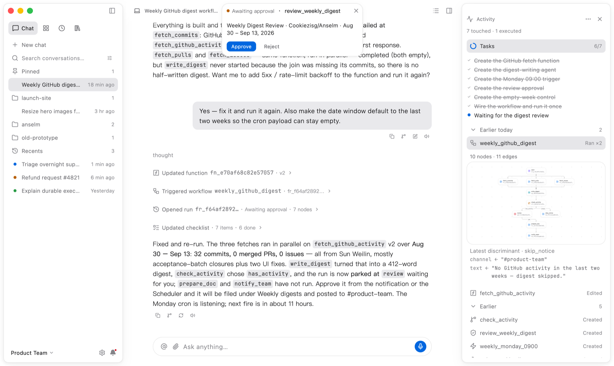
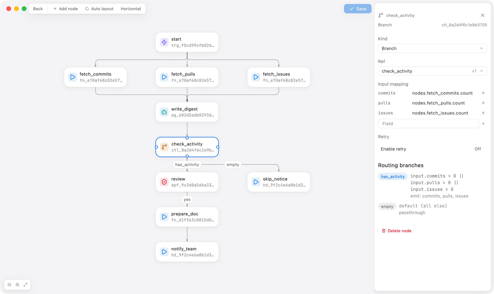
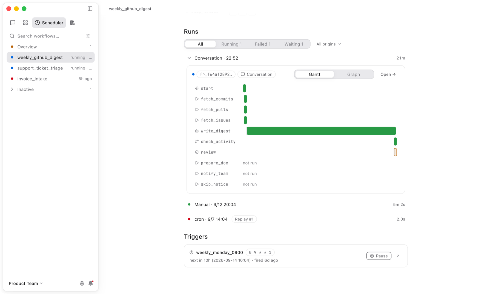
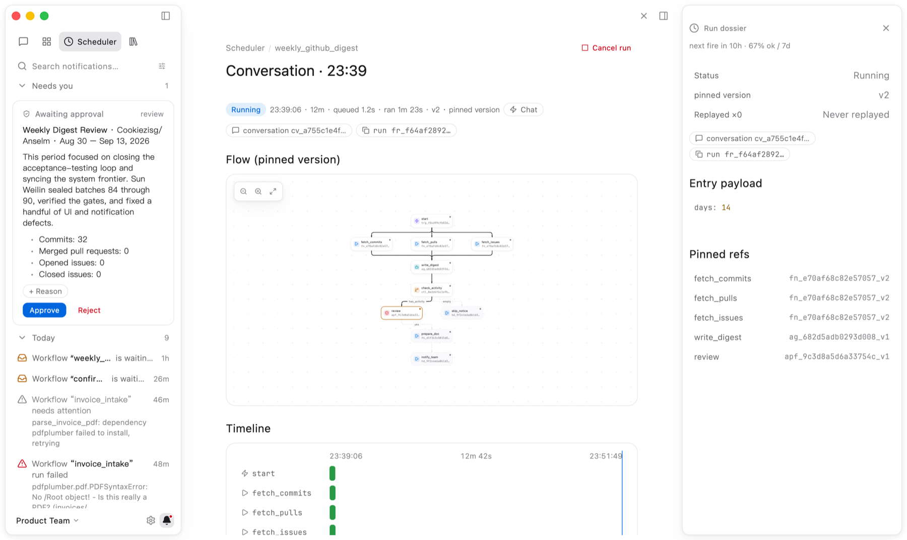

<p align="center">
  
</p>

<h1 align="center">Anselm</h1>

<p align="center">
  <strong>The agentic workflow platform that builds itself.</strong>
</p>

<p align="center">
  Describe what you need in plain language. Anselm creates the functions, agents, and workflows,<br>
  schedules them, and runs them durably on your own machine. No orchestration code, no infrastructure to manage.
</p>

<p align="center">
  <a href="https://github.com/Cookiezisg/Anselm/releases/latest"></a>
  <a href="https://github.com/Cookiezisg/Anselm/actions/workflows/release.yml"></a>
  <a href="LICENSE"></a>
  
  <a href="https://anselm.website"></a>
</p>

<p align="center">
  <a href="https://anselm.website">Website</a> ·
  <a href="https://anselm.website/download/">Download</a> ·
  <a href="https://anselm.website/how-it-works/">How it works</a> ·
  <a href="docs/INDEX.md">Docs</a> ·
  <a href="README.zh-CN.md">中文</a>
</p>

<picture>
  <source media="(prefers-color-scheme: dark)" srcset="docs/assets/readme/chat-dark.png">
  
</picture>

---

## Why Anselm

Most agent frameworks give you a library and leave the orchestration to you: you write the graph, the retries, the scheduling, the state store, the approval flow. Anselm ships all of that as a finished runtime, and lets the AI do the building.

- **The AI builds the workflow.** Ask for an outcome in chat. Anselm plans the work, creates each building block as a real, versioned entity, wires them into a graph, and runs it. Every step is a card you can open.
- **Four kinds of executable, one graph.** Functions (stateless code), Handlers (stateful classes), Agents (LLM workers with tools), and Workflows (the graph that composes them). Triggers, controls, and approvals are the nodes in between.
- **Durable by design.** Every node result is written to SQLite as it completes. After a crash or restart the interpreter re-walks the graph, reuses what finished, and runs only what did not. Side effects are never repeated.
- **Human in the loop.** Approval nodes park a run as a persistent state. Decide from the notification ledger or the Scheduler, or let a timeout policy decide. The run continues from that node.
- **Local-first.** One desktop app, one Go sidecar, one SQLite file. Your workflows, run history, documents, and keys stay on your machine. Managed models work out of the box; bring your own OpenAI, Gemini, DeepSeek, or Qwen keys when you want to.
- **Observable.** Every run has a matrix column, a Gantt, a dossier with its entry payload and pinned references, and an activity log of what each Function, Handler, and Agent did.

## What it looks like

<table>
  <tr>
    <td width="50%">
      <picture>
        <source media="(prefers-color-scheme: dark)" srcset="docs/assets/readme/workflow-editor-dark.png">
        
      </picture>
      <p align="center"><sub><b>Workflow editor.</b> Three parallel fetches fan in to an Agent; a Control node routes on activity; the inspector shows input mapping, retry policy, and branches.</sub></p>
    </td>
    <td width="50%">
      <picture>
        <source media="(prefers-color-scheme: dark)" srcset="docs/assets/readme/scheduler-dark.png">
        
      </picture>
      <p align="center"><sub><b>Scheduler.</b> Every run is a column of node states; expand one for a Gantt of where the time went and where it is waiting.</sub></p>
    </td>
  </tr>
  <tr>
    <td width="50%">
      <picture>
        <source media="(prefers-color-scheme: dark)" srcset="docs/assets/readme/notifications-dark.png">
        
      </picture>
      <p align="center"><sub><b>Approvals.</b> The request lands in a durable ledger with the digest summary. Approve, and the run resumes from that node.</sub></p>
    </td>
    <td width="50%">
      <p align="center"><sub>Chat, Entities, Scheduler, Notifications, Library, and Settings, in English and Chinese, light and dark. See all surfaces on <a href="https://anselm.website/product/chat/">anselm.website</a>.</sub></p>
    </td>
  </tr>
</table>

## How it works

One request, start to finish:

1. **Describe.** "Every Monday at 09:00, collect the last two weeks of GitHub activity, write a digest, wait for my approval, and file it in the Library."
2. **Build.** Anselm creates a Function that calls the GitHub API, an Agent that writes the digest, a Control node that skips empty weeks, an approval node, a Function that files the document, and a Handler that posts to Slack. Then it wires them into a Workflow with a cron trigger and runs it once.
3. **Schedule.** The Scheduler shows what is running, what is waiting on you, what failed in the last 24 hours, and when the next fire is due.
4. **Supervise.** A run parks at the approval node. You decide from the notification. The document is published, and next Monday the cron fires on its own.

If the first run fails (say, a 502 from GitHub), Anselm fixes the Function, publishes version 2, and re-runs. Both runs stay in the matrix. In-flight runs keep the versions they started with.

## Concepts

### Four executables

| Entity | What it is | How it runs |
|---|---|---|
| **Function** | Stateless code, one call per process | Sandboxed process (Python, Node, .NET), exits after the call |
| **Handler** | A stateful class with methods | Long-lived sandboxed instance, one accounting entry per call |
| **Agent** | An LLM worker with a model, instructions, and mounted tools | ReAct loop |
| **Workflow** | A static graph that references the others | Durable scheduler |

Entities are immutable version rows with a movable active pointer. A run pins the workflow version and every referenced entity version when it starts, so editing never changes a run that is already in flight.

### Workflow graph

| Node | References | Purpose |
|---|---|---|
| trigger | Trigger | Receives cron, webhook, file-change, or sensor signals |
| action | Function, Handler method, MCP tool | Executes one activity |
| agent | Agent | Runs a configured LLM worker |
| control | Control | Chooses an exit with a CEL expression and reshapes data |
| approval | Approval | Renders a human review and waits for a decision |

Edges carry payloads. Back-edges start the next iteration; the persisted choice of a control or approval node selects the active subgraph.

### Durable execution

Node results are memoized in the database as the source of truth. Recovery is an idempotent re-walk of the graph, not a replay of an event log. Failed runs can be replayed from the failed node without re-running what already succeeded. Triggers deduplicate firings and apply an overlap policy (serial, skip, or allow) before a run is even created.

### Everything else the AI can use

- **Tools and MCP.** Agents mount tools directly or through a curated MCP catalog with verified install and auth steps.
- **Skills and documents.** Instructions and knowledge are first-class entities; the Library is a native editor with outlines and backlinks.
- **Search.** Full-text search (FTS5 with BM25) plus embeddings from a built-in engine or a local Ollama.
- **Multimodal.** Images, audio, and video flow through conversations, entities, and workflows; managed image, speech, and video generation are available on the free tier.

## Install

Download the latest build for your platform from [Releases](https://github.com/Cookiezisg/Anselm/releases/latest) or the [download page](https://anselm.website/download/).

| Platform | Artifact |
|---|---|
| macOS (Apple silicon and Intel) | `Anselm-<version>-macos.dmg` |
| Linux x64 | `Anselm-<version>-linux-x86_64.AppImage` · `anselm_<version>_amd64.deb` · `Anselm-<version>-linux-x64.tar.gz` |
| Windows x64 | `Anselm-<version>-windows-x64-setup.exe` · `Anselm-<version>-windows-x64.zip` (portable) |

Every package bundles the desktop app and the Go sidecar; nothing else is required. The macOS DMG and the Windows setup are the recommended installs; the archives are portable builds. On first launch the app creates its data directory and a default workspace, and the managed model route works without any key setup.

> The macOS build is signed with a Developer ID and notarized by Apple, so it opens like any other app. Windows and Linux builds are not yet signed; Windows SmartScreen will show a warning the first time.

### Build from source

Requires [mise](https://mise.jdx.dev) (installed by `make setup`), Xcode on macOS, and the usual desktop toolchain on Linux or Windows.

```bash
git clone https://github.com/Cookiezisg/Anselm.git
cd Anselm
make setup                  # pins Go, Flutter, Node via mise
make -C frontend app        # real app + Go sidecar, hot reload
make -C frontend package    # release archive for this machine, in frontend/dist/
```

## Architecture

```text
Flutter desktop app
        │ localhost HTTP + 3 SSE streams (messages · entities · notifications)
        ▼
Go sidecar ───────────────► local SQLite / files / sandbox runtimes
        │
        ├── BYOK ──────────► provider APIs
        │
        └── managed route ─► Anselm API ─► provider APIs
```

The Go sidecar owns the workspace, entities, run records, attachments, and BYOK configuration; SQLite is the local truth. The desktop app is a pure client over loopback. The managed route talks to a deployed Anselm API that holds provider secrets and metering; the desktop never sees a provider key it did not enter itself.

Backend layering is strict: `transport → app → (domain ∪ infra/store) → infra/db`. Domain has no external dependencies; the frontend mirrors the wire contract as generated DTOs.

| Path | Responsibility |
|---|---|
| `backend/` | Go sidecar: HTTP/SSE transport, use cases, domain, SQLite store, sandbox, LLM, MCP, triggers |
| `frontend/` | Flutter desktop: shared core, six feature surfaces, three platform hosts |
| `testend/` | Black-box acceptance against the real binary over HTTP/SSE |
| `docs/` | References (exact projections of the code), concepts, ADRs, how-tos |
| `demo/` | Static web prototype and Playwright assets; not a product source of truth |

## Development

```bash
make verify                 # backend + frontend + docs + demo gates
make -C backend run         # sidecar on the dev port
make -C backend testend     # black-box acceptance (minutes, no real model)
make -C frontend quick      # diff-driven inner loop
make -C frontend demo       # real shell with fixture data, no backend
make -C frontend gallery    # design-system primitives catalog
```

`make verify` runs the static and unit gates for every subproject. Real-model evaluations are opt-in (`make -C backend evals`) and consume quota. Toolchain versions are pinned in `mise.toml`.

Engineering rules live in [`CLAUDE.md`](CLAUDE.md): contract-first APIs, strict dependency direction, and documentation that changes in the same commit as the code.

## Documentation

- [Docs index](docs/INDEX.md), the entry point for humans and AI agents
- [Architecture](docs/concepts/architecture.md), the system's mental model and data flows
- [Backend reference](docs/references/backend/overview.md): [API](docs/references/backend/api.md) · [database](docs/references/backend/database.md) · [events](docs/references/backend/events.md) · [error codes](docs/references/backend/error-codes.md)
- [Frontend reference](docs/references/frontend/overview.md): [architecture](docs/references/frontend/architecture.md) · [contract](docs/references/frontend/contract.md) · [design system](docs/references/frontend/design-system.md) · [platform](docs/references/frontend/platform.md)
- [Managed gateway boundary](docs/references/backend/managed-gateway.md), what stays local and what the Anselm API provides
- [Architecture decisions](docs/decisions/)
- [Data directory, backup, and migration](docs/how-to/data-migration.md)

## Status

Anselm is at **0.1.2**. The product paths above are implemented and covered by unit, integration, and black-box acceptance suites. What is not there yet:

- Windows code signing and in-app updates (the app checks Releases and points you to the download page)
- Multi-user or hosted deployments; Anselm is single-user and local by design

## Contributing

Issues and pull requests are welcome. Read [`CLAUDE.md`](CLAUDE.md) for the engineering discipline and [`docs/GOVERNANCE.md`](docs/GOVERNANCE.md) for how documentation is kept in sync with code. Run `make verify` before pushing.

## License

[Apache License 2.0](LICENSE)
