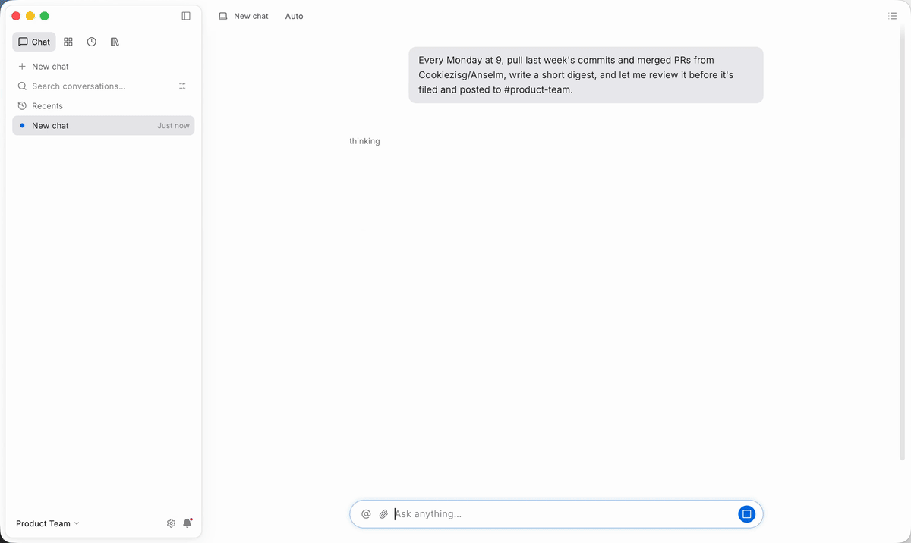

<p align="center">
  
</p>

<h1 align="center">Anselm</h1>

<p align="center">
  <strong>由 AI 自主编排的 Agentic Workflow 平台。</strong>
</p>

<p align="center">
  用一句话描述你要做的事。Anselm 自动创建函数、Agent 和工作流，安排调度，<br>
  并在你自己的机器上持久运行。不写编排代码，不管基础设施。
</p>

<p align="center">
  <a href="https://github.com/Cookiezisg/Anselm/releases/latest"></a>
  <a href="https://github.com/Cookiezisg/Anselm/actions/workflows/ci.yml"></a>
  <a href="LICENSE"></a>
  
  <a href="https://anselm.website/zh/"></a>
</p>

<p align="center">
  <a href="https://anselm.website/zh/">官网</a> ·
  <a href="https://anselm.website/zh/download/">下载</a> ·
  <a href="https://anselm.website/zh/how-it-works/">工作方式</a> ·
  <a href="docs/INDEX.md">文档</a> ·
  <a href="README.md">English</a>
</p>

<p align="center">
  
</p>

<p align="center"><sub>一句话进去。Anselm 写出 function、agent、trigger 和 workflow，跑一次，归档前停下等你审批。画面里全是真实的应用；模型回复是脚本化的，所以这段片子可复现（<code>make -C frontend demo DATASET=story LOCALE=en AUTOPLAY=promo</code>）。</sub></p>

---

## 为什么是 Anselm

大多数 Agent 框架给你一个库，编排留给你自己：图、重试、调度、状态存储、审批流程全要你写。Anselm 把这一整套作为成品运行时交付，并且让 AI 来做构建。

- **AI 构建工作流。** 在对话里说出你要的结果。Anselm 规划任务，把每个构件创建成真实的、带版本的实体，接成一张图，然后跑起来。每一步都是一张可以点开的卡片。
- **四种执行体，一张图。** 函数（无状态代码）、Handler（有状态类）、Agent（带工具的 LLM 工作者）、工作流（把它们组合起来的图）。触发器、控制和审批是中间的节点。
- **生来持久。** 每个节点结果完成即写入 SQLite。崩溃或重启后，解释器重新走图，复用已完成的部分，只执行没跑过的。外部副作用不会重复。
- **人在环中。** 审批节点让运行以持久状态停下。在通知账本或调度页里决定，或者交给超时策略。运行从这个节点继续。
- **本地优先。** 一个桌面应用、一个 Go sidecar、一个 SQLite 文件。工作流、运行历史、文档和密钥都留在你的机器上。受管模型开箱即用；想用自己的 OpenAI、Gemini、DeepSeek、Qwen 密钥也可以。
- **可观测。** 每次运行都有矩阵列、甘特图、带入口 payload 和钉住引用的卷宗，以及每个函数、Handler、Agent 做了什么的活动日志。

## 长什么样

<table>
  <tr>
    <td width="50%">
      <picture>
        <source media="(prefers-color-scheme: dark)" srcset="docs/assets/readme/workflow-editor-dark.png">
        
      </picture>
      <p align="center"><sub><b>工作流编辑器。</b>三路并行抓取汇入 Agent，控制节点按活动量分流，检查器展示输入映射、重试策略和分支。</sub></p>
    </td>
    <td width="50%">
      <picture>
        <source media="(prefers-color-scheme: dark)" srcset="docs/assets/readme/scheduler-dark.png">
        
      </picture>
      <p align="center"><sub><b>调度。</b>每次运行是一列节点状态；展开一条，看时间花在哪、停在哪。</sub></p>
    </td>
  </tr>
  <tr>
    <td width="50%">
      <picture>
        <source media="(prefers-color-scheme: dark)" srcset="docs/assets/readme/notifications-dark.png">
        
      </picture>
      <p align="center"><sub><b>审批。</b>请求连同周报摘要进入持久账本。批准后，运行从该节点继续。</sub></p>
    </td>
    <td width="50%">
      <p align="center"><sub>对话、实体、调度、通知、资料库、设置，中英双语，亮暗两色。全部界面见 <a href="https://anselm.website/zh/product/chat/">anselm.website</a>。</sub></p>
    </td>
  </tr>
</table>

## 它怎么工作

一个需求，从头到尾：

1. **描述。**"每周一 09:00 收集最近两周的 GitHub 活动，写一份周报，等我审批，然后归档到资料库。"
2. **构建。** Anselm 创建调用 GitHub API 的函数、写周报的 Agent、跳过空周的控制节点、审批节点、归档文档的函数，以及发 Slack 的 Handler。再把它们接成带 cron 触发器的工作流，跑一次。
3. **调度。** 调度页显示什么在跑、什么在等你、过去 24 小时什么失败了、下一次触发在什么时候。
4. **监督。** 运行停在审批节点，你在通知里决定。文档发布，下周一 cron 自己触发。

如果第一次运行失败（比如 GitHub 返回 502），Anselm 修好函数、发布 v2、重新运行。两次运行都留在矩阵里；在途运行保留它开始时的版本。

## 核心概念

### 四种执行体

| 实体 | 是什么 | 怎么跑 |
|---|---|---|
| **Function** | 无状态代码，每次调用一个进程 | 沙箱进程（Python、Node、.NET），调用结束即退出 |
| **Handler** | 带方法的有状态类 | 常驻沙箱实例，逐调用记账 |
| **Agent** | 带模型、指令和挂载工具的 LLM 工作者 | ReAct 循环 |
| **Workflow** | 引用其他实体的静态图 | 持久调度器 |

实体是不可变的版本行加可移动的 active 指针。运行开始时钉住工作流版本和每个引用实体的版本，编辑不会影响任何在途运行。

### 工作流图

| 节点 | 引用 | 作用 |
|---|---|---|
| trigger | Trigger | 接收 cron、webhook、文件变化或 sensor 信号 |
| action | Function、Handler 方法、MCP 工具 | 执行一个活动 |
| agent | Agent | 运行一个配置好的 LLM 工作者 |
| control | Control | 用 CEL 表达式选择出口并变换数据 |
| approval | Approval | 渲染人工审阅并等待决定 |

边是 payload 数据管道。回边进入下一次迭代；控制或审批节点已落库的选择决定当前活跃子图。

### 持久执行

节点结果作为事实源记忆化在数据库里。恢复是对图的幂等重走，不是回放事件日志。失败的运行可以从失败节点重放，不重跑已成功的部分。触发器在运行创建之前就完成去重并应用重叠策略（串行、跳过或允许）。

### AI 还能用什么

- **工具与 MCP。** Agent 直接挂载工具，或从经过核验安装与认证步骤的 MCP 精选目录里装。
- **技能与文档。** 指令和知识是一等实体；资料库是带大纲和反向链接的原生编辑器。
- **搜索。** 全文检索（FTS5 + BM25）加上内置引擎或本机 Ollama 提供的向量。
- **多模态。** 图片、音频、视频在对话、实体和工作流之间流动；免费层提供受管的图像、语音和视频生成。

## 安装

从 [Releases](https://github.com/Cookiezisg/Anselm/releases/latest) 或[下载页](https://anselm.website/zh/download/)获取对应平台的最新构建。

| 平台 | 文件 |
|---|---|
| macOS（Apple 芯片与 Intel） | `Anselm-<version>-macos.dmg` |
| Linux x64 | `Anselm-<version>-linux-x86_64.AppImage` · `anselm_<version>_amd64.deb` · `Anselm-<version>-linux-x64.tar.gz` |
| Windows x64 | `Anselm-<version>-windows-x64-setup.exe` · `Anselm-<version>-windows-x64.zip`（便携版） |

macOS 也可以用 Homebrew：

```bash
brew install --cask Cookiezisg/tap/anselm
```

每个包都自带桌面应用和 Go sidecar，不需要别的。macOS 用 DMG、Windows 用 setup 安装器；归档是便携版。首次启动时应用会创建数据目录和默认工作区，受管模型路径无需配置任何密钥。

> macOS 构建已用 Developer ID 签名并经 Apple 公证，像其他应用一样直接打开。Windows 与 Linux 构建尚未签名；Windows SmartScreen 首次会提示。签名政策见 [SECURITY.md](SECURITY.md#code-signing-policy)。

### 从源码构建

需要 [mise](https://mise.jdx.dev)（`make setup` 会安装）、macOS 上的 Xcode，以及 Linux 或 Windows 上常规的桌面工具链。

```bash
git clone https://github.com/Cookiezisg/Anselm.git
cd Anselm
make setup                  # 用 mise 钉住 Go、Flutter、Node
make -C frontend app        # 真 app + Go sidecar，热重载
make -C frontend package    # 本机发行包，输出到 frontend/dist/
```

## 架构

```text
Flutter 桌面应用
        │ localhost HTTP + 3 条 SSE 流（messages · entities · notifications）
        ▼
Go sidecar ───────────────► 本地 SQLite / 文件 / 沙箱运行时
        │
        ├── BYOK ──────────► 模型提供商 API
        │
        └── 受管路径 ──────► Anselm API ─► 模型提供商 API
```

Go sidecar 拥有工作区、实体、运行记录、附件和 BYOK 配置；SQLite 是本地事实。桌面应用是 loopback 上的纯客户端。受管路径连接已部署的 Anselm API，由它持有提供商密钥和计量；桌面端永远看不到不是自己录入的密钥。

后端分层严格单向：`transport → app → (domain ∪ infra/store) → infra/db`。domain 无外部依赖；前端以生成的 DTO 镜像线缆契约。

| 路径 | 职责 |
|---|---|
| `backend/` | Go sidecar：HTTP/SSE 传输、用例、领域、SQLite 存储、沙箱、LLM、MCP、触发器 |
| `frontend/` | Flutter 桌面端：共享地基、六个产品面、三平台宿主 |
| `testend/` | 对真实二进制经 HTTP/SSE 的黑盒验收 |
| `docs/` | reference（代码的精确投影）、concept、ADR、how-to |
| `demo/` | 静态 Web 原型与 Playwright 资产，不是产品事实源 |

## 开发

```bash
make verify                 # backend + frontend + docs + demo 门禁
make -C backend run         # 开发端口上的 sidecar
make -C backend testend     # 黑盒验收（分钟级，不调真实模型）
make -C frontend quick      # diff 驱动的内环
make -C frontend demo       # 真壳 + fixture 数据，零后端
make -C frontend gallery    # 设计系统原语目录
```

`make verify` 跑每个子项目的静态与单元门禁。真实模型评测需显式开启（`make -C backend evals`）并消耗额度。工具链版本钉在 `mise.toml`。

工程纪律见 [`CLAUDE.md`](CLAUDE.md)：契约先行的 API、严格的依赖方向、与代码同一提交更新的文档。

## 文档

- [文档索引](docs/INDEX.md)，人与 AI 代理的共同入口
- [架构](docs/concepts/architecture.md)，系统心智模型与数据流
- [后端参考](docs/references/backend/overview.md)：[API](docs/references/backend/api.md) · [数据库](docs/references/backend/database.md) · [事件](docs/references/backend/events.md) · [错误码](docs/references/backend/error-codes.md)
- [前端参考](docs/references/frontend/overview.md)：[架构](docs/references/frontend/architecture.md) · [契约](docs/references/frontend/contract.md) · [设计系统](docs/references/frontend/design-system.md) · [平台](docs/references/frontend/platform.md)
- [受管网关边界](docs/references/backend/managed-gateway.md)，什么留在本地、Anselm API 提供什么
- [架构决策记录](docs/decisions/)
- [数据目录、备份与迁移](docs/how-to/data-migration.md)

## 现状

Anselm 当前 **0.1.3**。上述产品路径均已实现，并由单元、集成与黑盒验收套件覆盖。尚未完成：

- Windows 签名（安装器未签名，首次运行 SmartScreen 会提示）
- 多用户或托管部署；Anselm 按单用户、本地设计

## 贡献

欢迎 issue 与 pull request。先读 [`CLAUDE.md`](CLAUDE.md) 了解工程纪律，[`docs/GOVERNANCE.md`](docs/GOVERNANCE.md) 了解文档如何与代码保持同步。推送前跑 `make verify`。

## 许可证

[Apache License 2.0](LICENSE)
